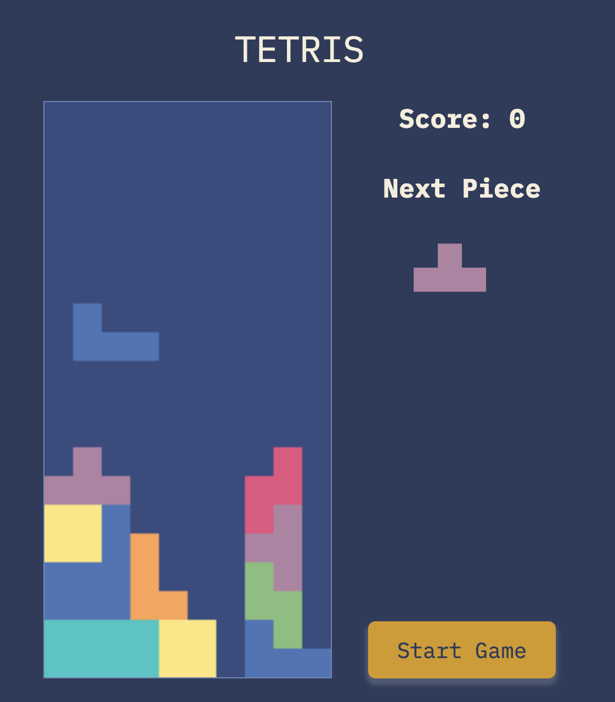

# Tetris

Tetris is a classic puzzle game where the player arranges blocks with different shapes in real-time as they fall from the top of the playing area. The goal is to create horizontal lines without gaps, which, when created, disappear, giving the player points. The game ends when the stack of blocks reaches the top of the playing area.

This version is a web-based game created as an educational project to practice the fundamentals of game development, client-side MVC architectural patterns, and Object-Oriented Programming in JavaScript while following the [Airbnb JavaScript Style Guide](https://github.com/airbnb/javascript).

  

## Technologies Used

- **JavaScript**: The core logic for game functions, including block movements, rotation, scoring, and collision detection.
- **HTML**: Used for structuring the game's viewport, next block preview, score display, and drawing graphics with the `<canvas>` element.
- **CSS**: Styles the game, including the positioning of the game area, interface elements, and overall look and feel.
- **MVC Architecture**: (Model-View-Controller) pattern is implemented here to separate concerns within the game. The model handles the game's state, the view renders the game on the browser, and the controller manages the user input and game logic.
- **Object-Oriented Programming (OOP)**: The application structure relies on OOP principles to define the game state and individual game elements as objects, facilitating easier management and scalability of the game code.
- **ESLint**: Used for formatting and maintaining a consistent coding style throughout following best practices.

## Getting Started

To play the game, you can visit the deployed version at https://drrosa.github.io/tetris. The game is fully playable in modern web browsers without the need for additional downloads or installations.

### How to Play:
- Use the arrow keys to move blocks left, right, and down.
- Use the 'up' arrow key to rotate a block.
- Try to fill up horizontal lines with blocks without any gaps. Each completed line will disappear, granting you points.
- The game ends when the blocks stack up to the top of the playing area.

## Next Steps

### Planned future enhancements:
- Adding a levels system where the game speed increases after clearing a certain number of lines.
- Adding a leaderboard system to display high scores.
- Mobile responsiveness to ensure an enjoyable gaming experience on smartphones and tablets.

Feel free to contribute or suggest improvements!
