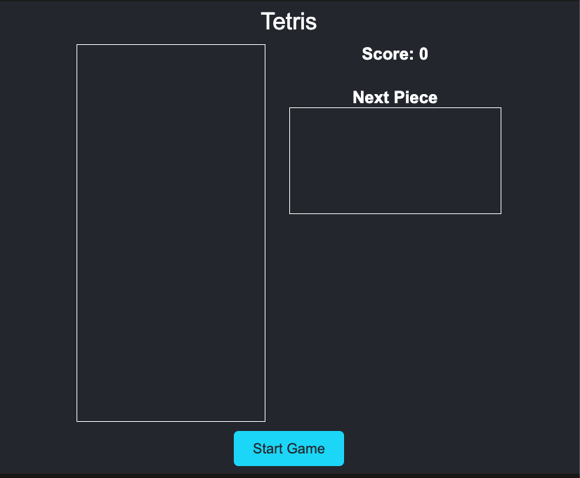

# Tetris implementation outline

## App's state

### Constants
- **ROWS:** Number of rows on the board, set to 10.
- **COLUMNS:** Number of columns on the board, set to 20.
- **BLOCK_SIZE:** Horizontal/vertical scaling factor for canvas units, set to 30.
- **TETRONIMOS:** Array of 2D arrays using 1s and 0s to represent the tetromino
  shapes: |, O, T, S, Z, J, L.
- **COLORS:** Array of strings representing the color of each tetromino
  cyan, yellow, purple, green, red, blue, orange, and white for empty squares.

### State variables
- **board:** 10x20 2D array representing each square of the play area,
  initialized to `null` values.
- **score:** Number of lines the player has cleared.
- **fallingPiece:**
  - shape: 2D square array of 1s and 0s representing a tetromino selected at
    random.
  - x: x-coordinate on the game board corresponding to the top-left square of
    the tetromino
  - y: y-coordinate on the game board corresponding to the top-left square of
    the tetromino
- **nextPiece:** Next piece to spawn selected at random from `PIECES` array.
- **gameStatus:** Holds value of `null`, `1`, or `0` to track whether the player
  has won, lost, or is playing the game.

## Cached element references
- **canvasContextEl:** 2D graphics element to render the game board on the page.
- **scoreEl:** Element to display the current score on the page.
- **nextPieceEl:** 2D graphics element to render the next piece to be spawned.

## Event listeners
- **Start game:** `click` event listener for the start game button.
- **Keyboard input:** `keydown` event listener for left, right, down, and up
  keyboard keys.

## Functions
- **Init:** Initializes state variables with `null` or `0` values as appropriate
  for the gameboard and score, and renders initial game state to the screen.
- **render:** Render functions for the board, score, next piece, falling piece,
  and game status message using current state variables.
- **spawnTetromino:** Initializes new randomly selected tetromino.
- **handleMoveDown:** Handles the `ArrowDown` event which increases the falling
  speed of the tetromino while the key is being pressed.
- **handleMoveRight:** Handles the `ArrowRight` event by moving the tetromino
  one unit to the right.
- **handleMoveLeft:** Handles the `ArrowLeft` event by moving the tetromino one
  unit to the left.
- **handleMoveUp:** Handles the `ArrowUp` event by rotating the falling
  tetromino 90 degrees.
- **handleSpaceBar:** Handles the `Space` event by dropping the falling
  tetromino to the bottom of the screen.
- **detectCollision:** Helper function called by the event handler functions to
  ensure the tetromino does not fall outside of the bounds of the game board,
  and to detect whether it has fallen on top of another tetromino.
- **checkBoard:** Checks the game board for rows that don't have any empty
  cells, removes them from the board, and increases the score for each row that
  has been cleared. Also checks for whether the player has won or lost the game.

## Wireframe

